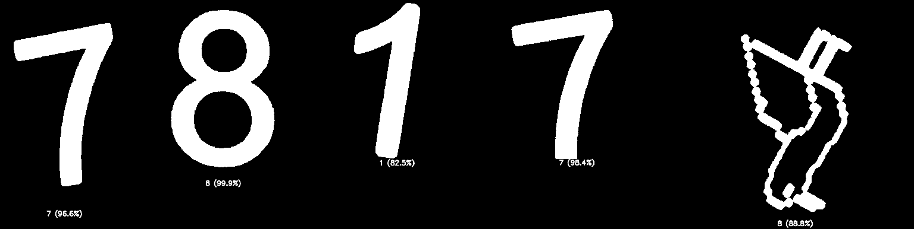

# ЛР №4 — Нейронные сети и распознавание изображений

БГУИР, ВМСиС, 2025

Проект для лабораторной работы по курсу ЦОСиИ (часть 2). Реализована простая сверточная нейросеть для распознавания рукописных цифр, обучение на датасетах MNIST/собственный (printed_digits), тестирование модели и применение к выделенным цифрам на изображении.

Исполняемые файлы:

- `with_opencv` — выделение цифр на изображении, выравнивание (PCA) и инференс модели
- `train` — обучение модели на выбранном датасете
- `test_model` — оценка модели на тестовой выборке MNIST

Набор примерных изображений для инференса: `images/`.

## Условие лабораторной работы

### 1. Исходные данные

- Лабораторная работа №3 (при необходимости — внести правки).

### 2. Задание

1. Ознакомиться с теорией.
2. Разработать нейронную сеть, способную распознавать цифры. Для обучения можно использовать либо готовый датасет из интернета (например, MNIST), либо создать свой собственный датасет.

## Пример работы



## Реализация в проекте

Компоненты:

- Класс `DigitNet` (`include/digitnet.h`) — компактная CNN: 2×Conv2d + 2×MaxPool + 2×Linear, выход — лог-вероятности 10 классов
- Тренировочный скрипт (`src/mains/train.cpp`) — поддерживает 3 варианта датасета:
- [`printed_digits`](https://github.com/kaydee0502/printed-digits-dataset): директории 0..9 с изображениями в `external/printed_digits/assets` (картинки с нулями пустые)
- [`mnist`](https://github.com/DeepTrackAI/MNIST_dataset): изображения в `external/mnist/mnist/train`
- `mnist0_printed_digits`: класс 0 из MNIST, 1–9 из printed_digits
- Тестирование (`src/mains/test_model.cpp`) — считает метрики на `external/mnist/mnist/test`
- Инференс на реальном изображении (`src/mains/main.cpp`/`with_opencv`) —
  - сегментация и выравнивание цифр (HSV-маска, морфология, компоненты связности, PCA-ориентация)
  - классификация каждой цифры выбранной моделью, нанесение метки и уверенности

Выходные модели сохраняются в `models/` с шаблоном имени:

- `models/digit_model_<dataset_name>_<epochs>.pt`

## Зависимости

- CMake 3.18+
- C++17 совместимый компилятор
- OpenCV (core, imgcodecs, imgproc, highgui)
- LibTorch (PyTorch C++): заголовки и библиотеки
- Опционально: Qt5 Widgets (диалоги выбора файла/параметров)
- Опционально: VTK (если требуется 3D-визуализация в других задачах)
- Опционально: NVIDIA CUDA Toolkit (ускорение вычислений Torch при наличии GPU)

Пример пакетов для Ubuntu/Debian (версии могут отличаться):

```bash
sudo apt update
sudo apt install cmake build-essential libopencv-dev
# Qt-диалоги (опционально)
sudo apt install qtbase5-dev
# CUDA Toolkit ставится из официальных репозиториев NVIDIA (опционально)
```

Установка LibTorch:

- Скачайте архив LibTorch (C++ Distribution) с официального сайта PyTorch, распакуйте и пропишите путь через переменные окружения/флаги CMake (например, `Torch_DIR` указывает на каталог с `TorchConfig.cmake`). В `CMakeLists.txt` используется `find_package(Torch REQUIRED)`.

Примечания по CUDA:

- При наличии совместимой видеокарты CUDA используется автоматически (см. `torch::cuda::is_available()`).
- Архитектура CUDA контролируется опцией CMake `CMAKE_CUDA_ARCHITECTURES` (по умолчанию `native`).

## Датасеты и git-субмодули

В репозитории подключены git-субмодули с датасетами, расположенными в каталоге `external/`:

- `external/printed_digits` → [github.com/kaydee0502/printed-digits-dataset](https://github.com/kaydee0502/printed-digits-dataset)
- `external/mnist` → [github.com/DeepTrackAI/MNIST_dataset](https://github.com/DeepTrackAI/MNIST_dataset)

Инициализируйте и обновите субмодули после клонирования:

```bash
# если репозиторий уже клонирован
git submodule update --init --recursive

# или сразу при клонировании
git clone --recurse-submodules <repo_url>
```

При необходимости обновить содержимое субмодулей до актуального состояния:

```bash
git submodule update --remote --recursive
```

После этого данные будут доступны по путям:

- `external/printed_digits/assets/0..9/*.png`
- `external/mnist/mnist/{train,test}/*.png`

## Сборка

Опции CMake:

- `-DENABLE_QT=ON|OFF` — использовать Qt5 Widgets для диалогов (по умолчанию ON)
- `-DCMAKE_CUDA_ARCHITECTURES=native|<arch>` — архитектура CUDA
- `-DCMAKE_BUILD_TYPE=Release|Debug` — тип сборки (по умолчанию Release)

Сборка:

```bash
mkdir -p build
cd build
cmake -DENABLE_QT=ON ..
cmake --build . -j
```

В результате будут собраны исполняемые файлы:

- `build/with_opencv` — инференс на изображении (выделение цифр + классификация)
- `build/train` — обучение модели
- `build/test_model` — тестирование модели на MNIST test

## Запуск

Проект поддерживает два способа ввода путей: через Qt-диалоги (ENABLE_QT=ON) или через аргументы командной строки (ENABLE_QT=OFF).

### with_opencv — инференс на изображении

```bash
# Qt включён — откроется диалог выбора изображения и диалог выбора модели .pt
./with_opencv

# Qt отключён — путь к изображению обязателен
./with_opencv ../images/1.jpg
```

Окна отображают промежуточные шаги сегментации и выравнивания. Закрытие — клавиша ESC в активном окне.

### train — обучение модели

Доступные датасеты: `printed_digits`, `mnist`, `mnist0_printed_digits`.

Размещение данных по умолчанию:

- `external/printed_digits/assets/0..9/*.png`
- `external/mnist/mnist/train/*.png`

```bash
# Qt включён — откроется диалог с выбором датасета и числа эпох
./train

# Без Qt — требуется указать имя датасета и число эпох
./train printed_digits 5
./train mnist 10
./train mnist0_printed_digits 20
```

Модель сохраняется в `models/` с именем `digit_model_<dataset>_<epochs>.pt`.

### test_model — оценка на MNIST test

Тестовая выборка по умолчанию: `external/mnist/mnist/test/*.png`.

```bash
# Qt включён — откроется диалог выбора модели .pt из каталога models/
./test_model [опционально: путь_к_модели.pt]

# Без Qt — путь к модели обязателен
./test_model ./models/digit_model_mnist_5.pt
```

Выводятся средняя потеря и точность на всей тестовой выборке.

## Структура проекта

```text
include/
 digitnet.h             # Архитектура CNN DigitNet
 image.h                # Вспомогательные утилиты (визуализация, конвертации)
src/
 image.cpp              # Реализация визуализации (ShowImages, ShowPCA и др.)
 mains/
   main.cpp              # Сегментация/выравнивание и инференс (with_opencv)
   train.cpp             # Обучение модели (train)
   test_model.cpp        # Тестирование модели (test_model)
external/
 mnist/                 # MNIST (train/test) в формате изображений
 printed_digits/        # Пользовательский датасет (assets/0..9/*.png)
models/                 # Сохранённые .pt-модели
images/                 # Примеры входных изображений
CMakeLists.txt          # Конфигурация сборки (OpenCV, Torch, Qt)
```

## Лицензия

Учебный проект. Используйте по назначению в рамках лабораторных работ.
